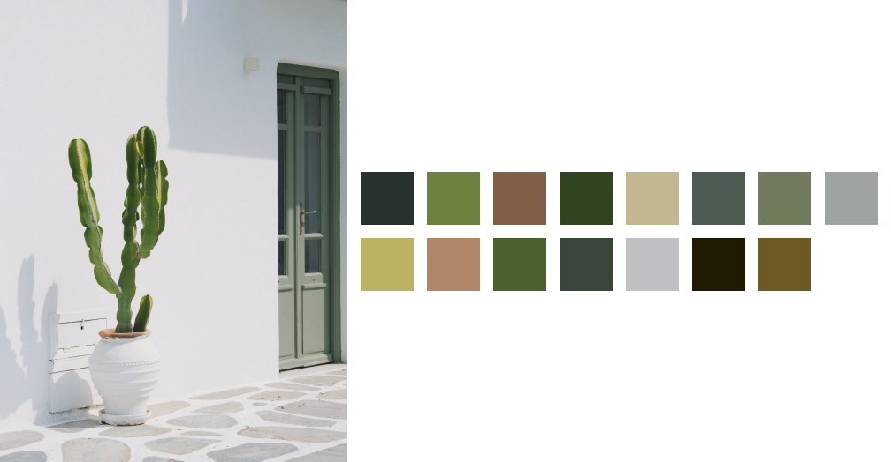
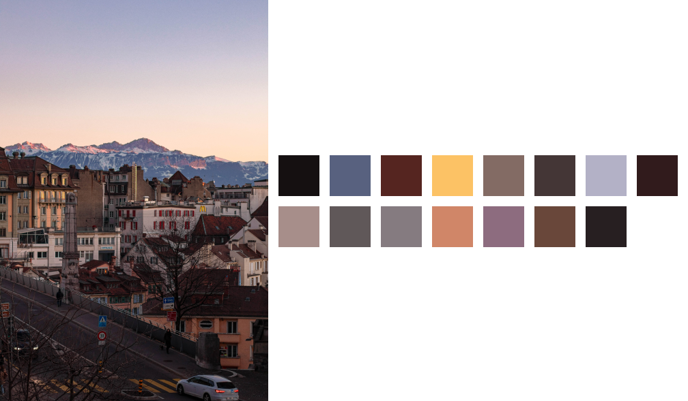

> ℹ️ For GraphicsMagick version please see tag [v0.2.1](https://github.com/josip/node-colour-extractor/tree/v0.2.1).

---

[](https://github.com/josip/node-colour-extractor/actions/workflows/CI.yml)

# colour-extractor

Extracts colour palettes from photos using k-means clustering in LAB colour space.





## Installation

Is as simple as with any other Node.js module:

    $ npm install @colour-extractor/colour-extractor

Note: The module contains native Rust libraries. Please open an issue if your platform isn't supported.

## Usage

`colour-extractor` exports two functions:

```js
const { topColours, topHexColours } = require('colour-extractor');
const colours = await topColours('Photos/Cats/01.jpg');
// => [ [158, 64, 75], ... ]
console.log(colours);
```

`topColours` function needs a path to your image (see below for supported formats) and it resolves to an `Array` containing RGB triplet for each prominent colour:

```json
[
  [46, 70, 118],
  [0,   0,   2],
  [12,  44,  11]
]
```

`topHexColours` works the same, but instead of a RGB triplet it returns hex codes (with `#` included):

```json
[
  '#2e4676',
  '#000002',
  '#0c2c0b'
]
```

## Supported image formats

All major image formats are supported, including PNG, JPG and WebP. Please see [image's readme](https://github.com/image-rs/image/blob/master/README.md#supported-image-formats) for a full list. Note that file extension is used for determening the image type.

## How does it work?

Here's the simplified algorithm:

1. Image is scaled down to 48x48px with a fast nearest-neighbour algoritm.
2. Colours are gruped into up to 16 clusters using [k-means clustering](https://en.wikipedia.org/wiki/K-means_clustering).
3. Identified clusters are further refined using [CIEDE2000 colour distance](https://en.wikipedia.org/wiki/Color_difference#CIEDE2000), removing any duplicates.

## License

colour-extractor is published under MIT license.

Photos used the examples above can be found on Unsplash:

  * https://unsplash.com/photos/7QaYj09Wbhs
  * https://unsplash.com/photos/pPRT4CLykp8
  * https://unsplash.com/photos/ttF84ygvliI
